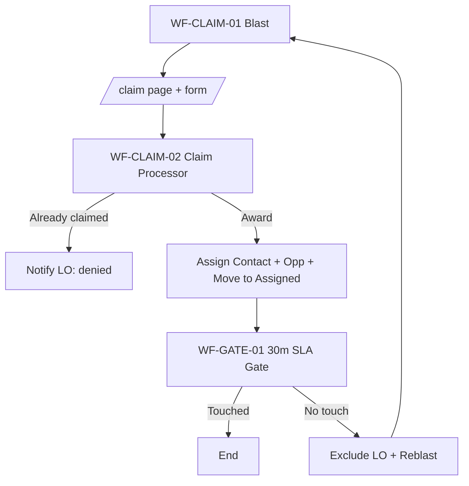
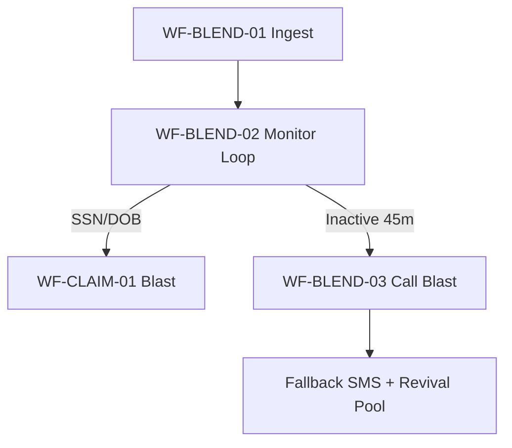

# GoHighLevel Build Spec (Blend Pre‑App → Claim → LO Gate → Post‑App)
**Client:** Jason Young / All Western Mortgage  
**Purpose:** Implement the full workflow/automation system described in the Fathom transcript (Dec 15) using **micro‑workflows** in a GHL sub‑account.  
**Document Date:** 2025-12-16  
**Scope:** **Location/Sub‑account only** (no agency-level features required).  
**Assumption:** Blend events are delivered into GHL (via your existing middleware/webhook setup). Everything else (claim page, assignment, stage movement, gating, messaging) is built **inside GHL**.

---

## How to use this document
- This file is written to be consumed by tools like **Codex/Cursor** to generate a visual map and to drive implementation.
- Every workflow below includes:
  - **Goal**
  - **Trigger(s)**
  - **Required fields/tags**
  - **Exact build steps (click path + action settings)**
  - **Exit criteria**
  - **Test cases**

---

# 1) System Overview

## 1.1 Business outcome
1) **Replace trigger links** with a **single Claim URL** that all Loan Officers (LOs) open.  
2) The Claim page shows **lead context** (name/city/loan amount/progress) before the LO calls.  
3) **First claim wins** (deterministic as GHL can practically provide; see “Concurrency note”).  
4) **Blend monitoring** checks activity every 5 minutes:
   - If **SSN/DOB entered** → trigger “Application Blast” to claim immediately.
   - If **inactive ≥45 minutes** → call blast revival, then SMS if unsuccessful.
5) After assignment, enforce **LO accountability**:
   - If LO doesn’t engage within **30 minutes**, automatically **reassign**, excluding the previous LO and emailing them why.
6) Special routing:
   - **Spanish speaking** leads → Spanish AI handling + tracking
   - **DNC/STOP** → suppress outreach + email-only instructions
   - **Loan amount mapping** → Opportunity Value + backfill support

---

## 1.2 Your existing pipelines (from screenshots)

### Pipeline A: **Pre‑Application – Unassigned New**
Stages you already created:
- Unassigned – New
- Unassigned – New – No Response
- Unassigned – Responded – AI Engaged
- Unassigned – Application Started – Actively Completing
- Unassigned – Working on Application (Blend Monitoring)
- Unassigned – Application Started – Not Finished
- Unassigned – Engaged – Awaiting Assignment
- Spanish Speaking – No Response
- Spanish Speaking – AI Engaged/LO Call Transcript
- Not Interested
- Move to Post‑App Queue App Taken
- DNC – Specific DNC Request

### Pipeline B: **Pre‑Application – Assigned New**
Stages you already created:
- SMS Engaged with AI
- SMS Engaged with LO
- Phone Engaged with LO
- Blend App Started – Unengaged
- Blend App Started – Engaged with AI
- Blend App Started – Engaged with LO
- Retargeted to New LO (Exclude Current Assignment…)

> **Recommendation (optional but cleaner):** Use the *Blend‑prefixed* stages as primary tracking states and reserve generic “SMS Engaged …” for non‑Blend cases or as tags.

---

## 1.3 High-level architecture (Mermaid)
```mermaid
flowchart TD
  A[Blend User Created / App Started Event] --> B[WF-BLEND-01 Ingest + Initial SMS]
  B --> C[WF-BLEND-02 Monitoring Loop (5 min)]
  C -->|SSN/DOB entered| D[WF-CLAIM-01 Application Blast]
  C -->|Inactive 45m| E[WF-BLEND-03 Inactivity Call Blast]
  D --> F[Claim Page + FORM-LO-CLAIM]
  F --> G[WF-CLAIM-02 Claim Processor]
  G -->|Award| H[Move to Assigned Pipeline + Start Gate]
  H --> I[WF-GATE-01 30m LO First-Touch Gate]
  I -->|No touch| D
  I -->|Touched| J[Normal LO Work / Post-App when ready]
```

---

# 2) One-time Setup (Required before workflows)

## 2.1 Create contact custom fields
**Path:** `Settings → Custom Fields → Contacts → + Add Field`

Create these fields **exactly** (names matter for your team’s consistency):

### (A) Claim / assignment control
- **CF – Claim Status** (Single line text)  
  - Allowed values (convention): `unclaimed`, `claimed`
- **CF – Claimed At** (Date & Time)
- **CF – Claimed By User ID** (Single line text)
- **CF – Claimed By Name** (Single line text)
- **CF – Claimed By Email** (Single line text)
- **CF – Excluded User ID** (Single line text) *(used after reassignment)*
- **CF – LO First Touch Completed** (Yes/No)
- **CF – LO First Touch At** (Date & Time)

### (B) Blend monitoring fields
- **CF – Blend App ID** (Single line text)
- **CF – Blend Status** (Single line text) *(e.g., started/in_progress/completed)*
- **CF – Blend Last Activity At** (Date & Time)
- **CF – Blend SSN Entered** (Yes/No)
- **CF – Blend DOB Entered** (Yes/No)
- **CF – Blend Progress %** (Number)
- **CF – Preferred Language** (Dropdown: English / Spanish / Other / Unknown)

### (C) Lead value tracking
- **CF – Loan Amount** (Currency or Number)
- *(Optional)* **CF – Purchase Price** (Currency or Number)

---

## 2.2 Create tags (recommended for workflow locks + audit)
**Path:** `Contacts → Tags` (or create within workflow actions)

Create these tags:
- `BLEND | App Started`
- `BLEND | Monitoring Active`
- `BLEND | Inactive 45m`
- `ASSIGNMENT | Needs LO`
- `ASSIGNMENT | Claimed`
- `SLA | Gate Active`
- `LANG | Spanish`
- `DNC | Requested`
- `DATA | Missing Loan Amount`

> Tags help you debug quickly and prevent “monolithic” logic.

---

## 2.3 Configure LO Team for internal SMS blast
**Path:** `Settings → My Staff → Teams → + Create Team`
- Team name: **Loan Officers**
- Add all LO users
- Confirm each LO user has:
  - Mobile number
  - Correct permissions to access Opportunities/Contacts they will work

---

## 2.4 Confirm “Opportunity ownership” expectations
Decide and standardize:
- Contact owner = LO user who claimed
- Opportunity owner = same LO user
- Opportunity pipeline changes must be explicit in workflows (never “implied”)

---

## 2.5 Concurrency note (First claim wins)
**Inside pure GHL**, you can build a strong “first claim wins” mechanism using:
- a lock field (`CF – Claim Status`)
- “assign only if unassigned” toggles (where available)
- immediate lock updates
- denial branch for already-claimed

**Edge case:** If two form submissions hit at the same millisecond, true atomic locking cannot be guaranteed by any UI automation platform.  
**Mitigation in this spec:** lock as the first action + avoid reassignment + deny excluded LO.

---

# 3) Build the Claim Page (inside GHL)

## 3.1 Create claim page
**Path:** `Sites → Funnels (or Websites) → + New → Page`

Create:
- Page name: **Claim Lead**
- Path: `/claim`

### Page content requirements
Show (minimum):
- Lead name
- City/State
- Loan amount
- Blend progress

**Implementation pattern (no-code):**
- Populate these via **URL query parameters**.

Example URL:
```
https://YOURDOMAIN.com/claim?lead_key=CONTACT_ID&lead_name=First%20Last&lead_city=City&loan_amount=123000&blend_progress=50&opp_id=OPP_ID
```

Add text elements like:
- `Lead: {lead_name}`
- `City: {lead_city}`
- `Loan Amount: {loan_amount}`
- `Progress: {blend_progress}%`

> Your page builder must support query parameter replacement. If it doesn’t in your current configuration, you’ll keep the lead context in the SMS blast and treat the page as “claim only”.

---

## 3.2 Create the claim form
**Path:** `Sites → Forms → + New Form`

Name: **FORM – LO Claim Lead**

Add fields:
1) **LO Name** (Text, required)  
2) **LO Email** (Email, required)  
3) **LO User ID** (Dropdown, required)  
   - Option Label: LO Name  
   - Option Value: LO’s GHL User ID  
4) **Lead Key** (Hidden field)  
   - Default value: `{lead_key}` (query param)
5) **Opportunity ID** (Hidden field)  
   - Default value: `{opp_id}`

Form settings:
- On submit → redirect to `/claim-success`

---

## 3.3 Create the claim success page
Create a page `/claim-success` with message:
- “✅ Claim submitted. If you were first, the lead is now assigned to you.”

---

# 4) Workflow List (What you must build)

## 4.1 The required workflows (by name)
1) **WF-BLEND-01** — Blend Event Ingest (User Created / App Started)
2) **WF-BLEND-02** — Blend Monitoring Loop (every 5 minutes)
3) **WF-BLEND-03** — Blend Inactivity Branch (45 minutes)
4) **WF-CLAIM-01** — Application Blast (send claim link to all LOs)
5) **WF-CLAIM-02** — Claim Processor (first claim wins; assign + move pipelines)
6) **WF-GATE-01** — 30-minute LO First-Touch Gate
7) **WF-GATE-02** — Mark First Touch (by LO message or transcript/task)
8) **WF-LANG-01** — Spanish Routing
9) **WF-DNC-01** — DNC Handler (STOP/DNC)
10) **WF-DATA-01** — Loan Amount → Opportunity Value sync
11) **WF-DATA-02** — Missing Loan Amount tagging (optional)
12) **WF-LEAD-01** — Not Interested handling (optional but recommended)

---

# 5) Workflow Build Specs (Step-by-step)

---

## WF-BLEND-01 — Blend Event Ingest (User Created / App Started)

### Goal
When Blend emits “user created/app started”, create/update the Contact + Opportunity, push them into the Blend pre-app path, send the initial SMS, and start monitoring.

### Trigger
Choose ONE (depends on your integration):
- **Inbound Webhook** (recommended) from your middleware with Blend payload
- OR any internal Blend integration trigger you already have working

### Required inputs (from Blend payload)
- email and/or phone
- Blend App ID
- preferred language (if provided)
- progress percent/stage (if provided)
- loan amount (if provided)

### Steps (build order)
**Path:** `Automation → Workflows → + Create Workflow`

1) **Action: Find/Create Contact**
   - If your workflow trigger already targets a contact, skip this.
   - Otherwise: create or update contact using email/phone.

2) **Action: Update Contact Fields**
   - CF – Blend App ID = from payload
   - CF – Blend Status = `started` (or payload value)
   - CF – Blend Progress % = from payload (if available)
   - CF – Preferred Language = from payload (if available)
   - CF – Loan Amount = from payload (if available)

3) **Action: Create/Update Opportunity**
   - Pipeline = **Pre‑Application – Unassigned New**
   - Stage = **Unassigned – Application Started – Actively Completing**
   - Opportunity Value = (CF – Loan Amount) when available
   - Owner = blank/unassigned at this point

4) **Action: Add Tag**
   - `BLEND | App Started`

5) **Action: Send SMS to Lead**
   - Example: “I see you began your application — I’m here if you have any questions.”

6) **Action: Add to Workflow**
   - Add contact to **WF-BLEND-02 — Blend Monitoring Loop**

### Exit criteria
- Contact exists with Blend fields set
- Opportunity exists in Unassigned pipeline at “Actively Completing”
- Monitoring workflow started

### Test cases
- Blend start event creates contact and opportunity
- Stage set correctly
- SMS sent once (no duplicates)

---

## WF-BLEND-02 — Blend Monitoring Loop (every 5 minutes)

### Goal
Poll for progress and route:
- SSN/DOB entered → assignment blast immediately
- inactivity ≥45m → call blast

### Trigger
- **Added to Workflow** from WF-BLEND-01

### Steps
1) **Action: Update Opportunity Stage**
   - Pipeline: Pre‑Application – Unassigned New
   - Stage: **Unassigned – Working on Application (Blend Monitoring)**

2) **Action: Add Tag**
   - `BLEND | Monitoring Active`

3) **Loop block (repeat)**
   1) **Wait**
      - 5 minutes

   2) **Action: Webhook (Outbound) → “Check Blend Status”**
      - Call your middleware endpoint that:
        - queries Blend
        - updates these contact fields in GHL:
          - CF – Blend Last Activity At
          - CF – Blend SSN Entered
          - CF – Blend DOB Entered
          - CF – Blend Progress %
          - CF – Blend Status
      - If you cannot update GHL from the middleware, then have middleware POST an inbound webhook to a separate “Blend Status Update” workflow that updates fields.

   3) **IF/ELSE: SSN/DOB entered**
      - Condition: CF – Blend SSN Entered = Yes OR CF – Blend DOB Entered = Yes
      - **YES branch:**
        - Remove tag `BLEND | Monitoring Active`
        - Remove contact from this workflow (stop loop)
        - Add to workflow **WF-CLAIM-01 — Application Blast**
      - **NO branch:** continue

   4) **IF/ELSE: Inactive ≥45 minutes**
      - If you store minutes-since-last-activity, use that.
      - If you store timestamps only, your middleware should compute inactivity and set a boolean field or tag.
      - Condition option A (preferred):
        - Tag `BLEND | Inactive 45m` exists
      - Condition option B:
        - custom “inactive” boolean field = true
      - **YES branch:**
        - Remove tag `BLEND | Monitoring Active`
        - Remove contact from this workflow
        - Add to workflow **WF-BLEND-03 — Inactivity Branch**
      - **NO branch:** continue looping

### Exit criteria
- Monitoring stops when either:
  - assignment blast fires, or
  - inactivity branch fires, or
  - app completes (optional extension)

### Test cases
- Lead hits monitoring stage immediately
- After SSN entered → blast triggers within one polling cycle
- After 45 mins inactivity → call blast triggers

---

## WF-BLEND-03 — Inactivity Branch (45 minutes)

### Goal
Revive stalled app:
- call blast
- if unsuccessful → SMS follow-up
- then return to general revival pool (handled by your global AI layer or future retargeting pipeline)

### Trigger
- Added to workflow from WF-BLEND-02 inactivity branch

### Steps
1) **Action: Update Opportunity Stage**
   - Pipeline: Pre‑Application – Unassigned New
   - Stage: **Unassigned – Application Started – Not Finished**

2) **Action: (Optional) Add Note**
   - “Blend inactive ≥45m → initiating call blast”

3) **Action: Start Call Blast sequence**
   - If you already have a call blast micro-workflow, call it using “Add to Workflow”.
   - Otherwise, implement here:
     - Attempt 1: call lead (from your dialer/call action)
     - If no answer:
       - Attempt 2 (optional)
     - After attempts:
       - Send SMS: “Just tried to give you a call — I saw you started the application but didn’t finish. Can I help?”

4) **Action: Routing after blast**
   - If lead replies later, your “Customer Replied” logic should push them back into assignment flow or AI engagement.

### Exit criteria
- Call blast executed and follow-up SMS sent if needed

### Test cases
- Inactivity triggers branch and stops monitoring loop
- SMS follow-up sent only after failed call attempts

---

## WF-CLAIM-01 — Application Blast (send claim link to all LOs)

### Goal
Send a single message to all LOs with one claim link so everyone has equal response time and can see lead context before claiming.

### Trigger
- Added to workflow from:
  - WF-BLEND-02 (SSN/DOB entered)
  - OR from other flows (ex: engaged + started app)

### Steps
1) **Action: Update Opportunity Stage**
   - Pipeline: Pre‑Application – Unassigned New
   - Stage: **Unassigned – Engaged – Awaiting Assignment**

2) **Action: Set claim fields**
   - CF – Claim Status = `unclaimed`
   - CF – Claimed At = blank (optional reset)
   - CF – Claimed By … = blank (optional reset)

3) **Action: Add Tag**
   - `ASSIGNMENT | Needs LO`

4) **Action: Internal Notification (SMS) → Team “Loan Officers”**
   - Message must include claim URL + context
   - Template example:
     ```
     🔥 Application Ready to Claim
     Lead: {contact.first_name} {contact.last_name}
     City: {contact.city}
     Loan: {custom_field.loan_amount}
     Progress: {custom_field.blend_progress_%}%

     Claim:
     https://YOURDOMAIN.com/claim?lead_key={contact.id}&lead_name={contact.first_name}%20{contact.last_name}&lead_city={contact.city}&loan_amount={custom_field.loan_amount}&blend_progress={custom_field.blend_progress_%}&opp_id={opportunity.id}
     ```

5) **Action: (Optional) Admin notification**
   - Send internal email/slack note “Blast sent for {contact.id}”

### Exit criteria
- Blast sent once
- Lead now sits in “Awaiting Assignment” stage until claimed

### Test cases
- Blast arrives to all LOs
- Link opens and shows lead context
- Form submits successfully

---

## WF-CLAIM-02 — Claim Processor (first claim wins; assigns lead)

### Goal
Process claim submissions and award lead to the first claimant only. Move to Assigned pipeline and start the 30-min gate.

### Trigger
Choose ONE:
- **Form Submitted** (FORM – LO Claim Lead)  ← simplest
- OR **Inbound Webhook** if you want more logging separation

**Use Form Submitted** to keep it purely inside GHL.

### Build steps (Form Submitted version)
1) **Guardrail 1: Deny excluded LO (reassignment protection)**
   - IF/ELSE:
     - If `CF – Excluded User ID` is not empty AND form LO User ID equals excluded user id → deny
   - Deny branch:
     - Internal notification email to LO: “You’re excluded from reclaiming this lead due to SLA timeout.”

2) **Guardrail 2: First claim wins**
   - IF/ELSE:
     - If `CF – Claim Status` equals `claimed` OR `CF – Claimed At` is not empty → already claimed
   - Already claimed branch:
     - Send internal notification to LO email:
       - “Lead already claimed by another LO.”
     - End workflow.

3) **Award branch (unclaimed)**
   - **Action: Update Contact Fields (LOCK FIRST)**
     - CF – Claim Status = `claimed`
     - CF – Claimed At = now
     - CF – Claimed By User ID = (form field LO User ID)
     - CF – Claimed By Name = (form field LO Name)
     - CF – Claimed By Email = (form field LO Email)

   - **Action: Assign Contact Owner**
     - Assign to User = LO User ID (form field)
     - Turn ON: “Only assign if unassigned” (if toggle exists)

   - **Action: Update Opportunity**
     - Pipeline: **Pre‑Application – Assigned New**
     - Stage: **Blend App Started – Unengaged** (or Engaged w/ AI depending on your rules)
     - Owner: same LO User ID (if supported)

   - **Action: Remove tag** `ASSIGNMENT | Needs LO`
   - **Action: Add tag** `ASSIGNMENT | Claimed`

   - **Action: Create Task** (for accountability)
     - Title: `FIRST TOUCH REQUIRED (30 MIN SLA)`
     - Assigned to: Contact owner
     - Due date: now + 30 min

   - **Action: Add tag** `SLA | Gate Active`

   - **Action: Add to Workflow**
     - WF-GATE-01 — 30-minute LO First-Touch Gate

   - **Action: Internal Notification to claiming LO**
     - “✅ You claimed {contact.name}. First touch required within 30 minutes.”

### Exit criteria
- Contact + opportunity assigned to LO
- Opportunity moved to assigned pipeline
- SLA task created + gate started

### Test cases
- Two LOs submit: first gets awarded; second gets denial message
- Excluded LO cannot reclaim after reassignment

---

## WF-GATE-01 — 30-minute LO First-Touch Gate

### Goal
If LO does not engage within 30 minutes after claiming, reassign and notify them why.

### Trigger
- Tag Added: `SLA | Gate Active`
  *(Added at the end of Claim Processor)*

### Steps
1) **Set baseline fields**
   - CF – LO First Touch Completed = No
   - CF – LO First Touch At = blank

2) **Wait**
   - 30 minutes

3) **IF/ELSE: First Touch Completed**
   - Condition: CF – LO First Touch Completed = Yes
   - YES → End
   - NO → reassign

4) **Reassignment branch**
   - **Action: Capture exclusion**
     - CF – Excluded User ID = current Contact Owner User ID (or CF – Claimed By User ID)

   - **Action: Email previous LO**
     - To: CF – Claimed By Email
     - Subject: “Lead reassigned (no engagement within 30 min)”
     - Body: include lead name + timestamps

   - **Action: Reset claim lock**
     - CF – Claim Status = `unclaimed`
     - CF – Claimed At = blank
     - CF – Claimed By ... = blank
     - Remove tag: `ASSIGNMENT | Claimed`
     - Add tag: `ASSIGNMENT | Needs LO`

   - **Action: Update Opportunity Stage**
     - Pipeline: Pre‑Application – Assigned New
     - Stage: **Retargeted to New LO (Exclude Current Assignment…)**
     - (Optional) Move back to Unassigned pipeline stage “Awaiting Assignment” if you prefer, but keep analytics consistent.

   - **Action: Add to Workflow**
     - WF-CLAIM-01 — Application Blast (reblast)

### Exit criteria
- If touched: gate ends
- If not touched: lead reblasts and excluded LO is recorded

### Test cases
- LO claims, does nothing → lead gets reblasted at 30 minutes and LO receives email
- Exclusion prevents immediate reclaim

---

## WF-GATE-02 — Mark First Touch (how to set “LO First Touch Completed”)

### Goal
When LO actually engages (message or real call), mark first touch complete and move stages for analytics.

### Trigger options (use BOTH; separate workflows if needed)

**A) LO sends an outbound message**
- Trigger: “Customer Replied” is not correct here; you need LO outbound.
- If GHL supports trigger: “Message Sent” by user → use it.
- If not available, use tasks as the authoritative trigger:
  - LO must complete the “FIRST TOUCH REQUIRED” task after sending first message.

**B) Call connected**
- Trigger: “Transcript Generated” (best indicator of successful call)

### Steps (Task-based version — simplest)
1) Trigger: **Task Completed**
   - Filter: task title contains `FIRST TOUCH REQUIRED`

2) Actions:
   - CF – LO First Touch Completed = Yes
   - CF – LO First Touch At = now
   - Remove tag `SLA | Gate Active`
   - Update Opportunity Stage:
     - If LO engaged by SMS → **Blend App Started – Engaged with LO**
     - If call transcript exists → **Phone Engaged with LO**

### Steps (Transcript-based version)
1) Trigger: Transcript Generated
2) Actions:
   - CF – LO First Touch Completed = Yes
   - CF – LO First Touch At = now
   - Move stage: **Phone Engaged with LO**
   - Remove from gate workflow if needed

### Exit criteria
- LO First Touch fields updated and gate can end naturally

### Test cases
- Completing SLA task stops reassignment
- Call transcript stops reassignment

---

## WF-LANG-01 — Spanish Routing

### Goal
Detect Spanish leads (preferred language OR Spanish response) and route to Spanish AI handling + tracking stages.

### Trigger options
- **Preferred Language field updated** to Spanish
- **Customer Replied** → then run AI classification to detect Spanish
- **Transcript Generated** → then classify language

### Build steps
1) IF/ELSE: Preferred Language = Spanish
   - YES:
     - Add tag `LANG | Spanish`
     - Update Opportunity stage:
       - If unassigned: **Spanish Speaking – No Response** or **Spanish Speaking – AI Engaged/LO Call Transcript**
     - Start Spanish AI engagement workflow (if you have one)

2) If using message-based detection:
   - Trigger: Customer Replied
   - Action: AI classification (if available in your account) or keyword heuristic
   - If Spanish → apply same routing above

### Exit criteria
- Spanish leads are isolated in their own stages for reporting and are engaged appropriately

### Test cases
- Blend preferred language routes correctly
- Spanish reply routes correctly

---

## WF-DNC-01 — DNC / STOP Handler

### Goal
If contact opts out, stop calling/texting and send email re-engagement instructions.

### Trigger
- Keyword trigger (STOP, DNC) in inbound SMS (if configured)
- Or “Contact DND enabled” trigger (if available)

### Steps
1) Update opportunity stage: **DNC – Specific DNC Request**
2) Add tag: `DNC | Requested`
3) Disable SMS/calls for the contact (DND actions as available)
4) Send Email:
   - “We’ve disabled outreach. If you want to re-engage, reply here or…”
5) Remove from active workflows (monitoring/claim/gate)

### Exit criteria
- Contact is suppressed and moved to DNC stage

### Test cases
- STOP triggers DNC stage and suppresses future outreach

---

## WF-DATA-01 — Loan Amount → Opportunity Value Sync

### Goal
Ensure Opportunity Value is set from Loan Amount for accurate reporting.

### Trigger options
- Opportunity Created
- Contact Field Updated: CF – Loan Amount

### Steps
1) IF/ELSE:
   - If CF – Loan Amount is empty → add tag `DATA | Missing Loan Amount` and end
2) Update Opportunity:
   - Set Opportunity Value = CF – Loan Amount

### Exit criteria
- Opportunity value is reliably populated

### Test cases
- Zillow/MRC leads populate value
- Missing values get tagged for backfill

---

## WF-LEAD-01 — Not Interested Handling (recommended)

### Goal
If lead explicitly says they are not interested, respond politely and route them for later re-engagement (no aggressive chasing).

### Trigger
- Customer Replied (in lead intake / AI messages)
- Then AI intent classification = “not interested” (or keyword rules)

### Steps
1) Update opportunity stage:
   - **Not Interested**
2) Send SMS:
   - “Thanks — I’ll stop reaching out. If you ever want help, text us anytime.”
3) Add tag:
   - `NOT INTERESTED | CONFIRMED`
4) Remove from active micro-workflows

### Exit criteria
- Lead is categorized and no longer spams pipeline logic

### Test cases
- “not ready / wrong person / stop” routes correctly

---

# 6) Implementation Order (Do this in order)

1) **Create fields/tags/teams** (Section 2)
2) Build claim pages + claim form (Section 3)
3) Build **WF-CLAIM-01** and **WF-CLAIM-02** (blast + claim processor)
4) Build **WF-GATE-01** and **WF-GATE-02** (SLA gate + first touch marker)
5) Build **WF-BLEND-01** (Blend ingest)
6) Build **WF-BLEND-02** and **WF-BLEND-03** (monitor + inactivity)
7) Build Spanish routing + DNC + data sync workflows
8) Run tests (below)

---

# 7) End-to-End Test Plan

## Test A — Blend start
- Send a test Blend “user created” event
- Confirm:
  - Contact created
  - Opportunity created in Unassigned pipeline “Actively Completing”
  - SMS sent
  - Monitoring started

## Test B — SSN entered triggers assignment blast
- Simulate middleware update setting:
  - CF – Blend SSN Entered = Yes
- Confirm:
  - monitoring stops
  - stage moves to Awaiting Assignment
  - LO team receives blast with claim link

## Test C — Claim concurrency
- Two LOs submit the claim form within seconds
- Confirm:
  - First gets assigned
  - Second receives denial

## Test D — SLA gate
- Claim and do nothing
- Confirm:
  - at 30 minutes: reblast occurs
  - excluded LO recorded
  - previous LO receives email

## Test E — Inactivity 45m
- Simulate inactivity by setting tag/field used by your inactivity check
- Confirm:
  - moved to Not Finished stage
  - call blast fires
  - follow-up SMS sent after failure

## Test F — Spanish
- Set Preferred Language = Spanish
- Confirm Spanish stage + Spanish AI flow

## Test G — STOP/DNC
- Send STOP
- Confirm DNC stage + suppression + email

---

# 8) Visual workflow map (Mermaid per subsystem)

## 8.1 Claim subsystem


## 8.2 Blend monitoring subsystem


---

# 9) “Gotchas” Checklist (Read before going live)
- ✅ Ensure **contact owner + opportunity owner** both change on claim.
- ✅ Ensure blast uses correct domain and the claim URL is reachable by LOs on mobile.
- ✅ Ensure excluded LO logic blocks immediate reclaim after timeout.
- ✅ Ensure monitoring loop is stopped when assignment/inactivity happens.
- ✅ Ensure no duplicate opportunities are created for the same contact.
- ✅ Ensure loan amount mapping is reliable before you scale lead volume.
- ✅ Ensure “Phone Engaged” uses Transcript Generated rather than call attempt.

---

# 10) Open items you must confirm during implementation
These are configuration-dependent in GHL and you should decide once:
1) Do you want re-assigned deals to move back into **Unassigned** pipeline, or stay in **Assigned** pipeline “Retargeted…”?
2) What counts as “LO engaged”:
   - completion of SLA task?
   - outbound SMS logged?
   - transcript generated?
   (This spec supports all; pick one primary.)

---

**End of build spec.**
